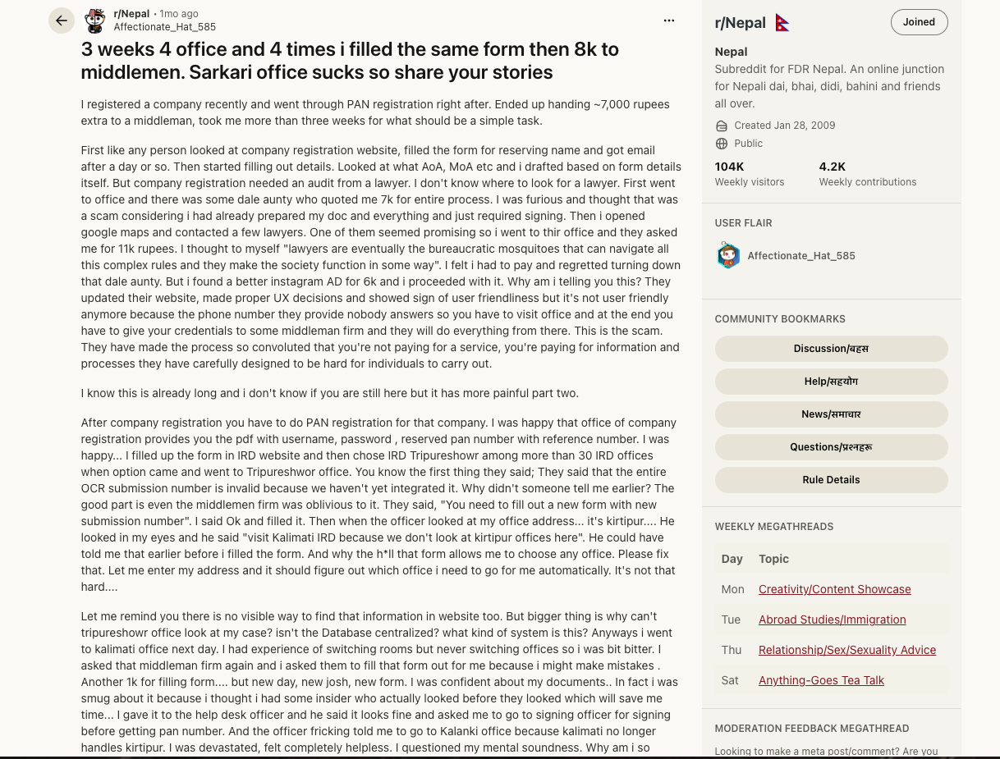

# PreVillage Gemma for Good - 3 Minute Rough Spec v1

Deadline: 2026-05-19 05:44 NPT.

Target runtime: 180 seconds.

Working title: **PreVillage: public-service knowledge before privilege**.

## Core Argument

Nepal's government information problem is not just "bad websites" or missing
documents. It is a routing problem, an intent problem, and a tacit-knowledge
problem.

People do not only need an answer. They need the system to first understand the
case: which service, which ward or district, which office, which document, which
counter, which fee, and what to do when the official source is silent.

PreVillage is the infrastructure layer for that:

- resolver/intake first, not generic Q&A;
- official RAG plus practical human sources;
- self-healing source crawl and health checks;
- human-in-the-loop officer/contact path when knowledge is missing;
- voice, kiosk, WhatsApp, and web entry points;
- small Gemma models for local/on-prem office deployment.

Core line:

> I used privilege to find the path. PreVillage exists so the next person does
> not need privilege to use their own government.

## What We Already Have

### Existing Real-World Footage

Raw copied to:

```text
/mnt/transcend4tb/video-creation/previllage-gemma-for-good-2026/footage/raw/PreVillageSpeaks2
```

Manifest:

```text
/mnt/transcend4tb/video-creation/previllage-gemma-for-good-2026/footage/raw/PreVillageSpeaks2_manifest.tsv
```

Inventory: 19 videos + 1 photo, about 27 GB, about 86 minutes total.

Strong bins:

- Jiri road and mountain journey: establishes the 180 km fieldwork and the
  "privilege to travel and decode the path" theme.
- Public office pitch: long meeting footage showing the idea being presented to
  officials in a real municipality setting.
- Practical office/interview footage: desk, laptop, forms, information officer
  context.
- Existing screen/UI clips: rough TTS, portal, admin, and build footage.

### Existing Technical Footage / Reproducible Capture

- Training/tmux replay scripts for ASR, TTS, RAG, and SFT-style build proof.
- RAG architecture recording tmux:
  - source registry;
  - MoHA office discovery;
  - crawl/self-healing;
  - health audit;
  - resolver/planner contract;
  - human practical-source loop.
- Raspberry Pi local Gemma E2B footage captured.
- Pi benchmark data:
  - Pi 5, 7.9 GiB RAM;
  - Gemma E2B Q4 via llama.cpp;
  - short service-navigation answers around 6-8 generated tokens/sec;
  - warm TTS around 1.1-1.4s per short sample after load;
  - warm ASR around 2.9-3.0s per short sample after load.
- Live helpdesk behavior patched so generic English/Nepali government-help
  prompts ask a service-intake follow-up instead of retrieving random sources.
- SFT/RAG evolution docs from v1 through v6.4:
  - v1: grounded answers but no refusal discipline;
  - v2: refusal and Roman-Nepali repair;
  - v3: anti-template/terse work exposed regressions;
  - v4: corpus cleanup, real chunks, trainer discipline;
  - v5: trained but failed smoke testing, not deployable;
  - v6.4: planner/composer split works behind RAG, not as a naked factual bot.

### Existing Story Assets

- Reddit origin story:
  - 3 weeks;
  - 4 offices;
  - 4 versions of the same form;
  - almost 8k rupees to middlemen;
  - core sentence: people were paying for information, not the service.
- Sister voice recording footage for TTS collection.
- ASR/TTS/G2P/voice portal work on Ampixa.
- Jiri fieldwork and interviews.

## What Is Still Missing

These are the only high-priority missing captures before we can make a credible
rough cut:

1. **Kiosk mode with 3-4 people**
   - outside or semi-public setting for energy;
   - one office-like desk setup for the deployment story;
   - each person asks one simple government-service question;
   - capture screen, voice, and one short reaction line.

2. **WhatsApp mode with 5-6 people**
   - same opening prompt for montage consistency;
   - different follow-up details per person;
   - hide phone numbers and private identifiers;
   - capture at least one "system asks first" moment.

3. **Clean product screen recordings**
   - kiosk voice flow;
   - chat flow with follow-up;
   - source-backed answer;
   - WhatsApp handoff/contact-officer gap;
   - admin/practical-source review;
   - ASR/TTS pages on Ampixa.

4. **Founder pickup lines**
   - "Gemma was pivotal because...";
   - "The issue is not just tacit knowledge; it is routing a needle in a
     haystack.";
   - "I used privilege to find the path...";
   - "A website is still a privileged interface; WhatsApp and voice are how many
     people already ask for help."

5. **Clean technical graphics**
   - PreVillage architecture card;
   - v1-v6 learning ladder;
   - RAG source-registry/crawl/health loop card;
   - human practical-source handoff card.

## Final Video Shape

The edit should feel like an argument, not a subsystem tour:

1. Pain: the hidden route through government.
2. Confession: privilege made it possible to decode the route.
3. Diagnosis: the problem is intent routing plus tacit knowledge.
4. PreVillage answer: source registry + RAG + resolver + self-healing +
   human loop.
5. Learning proof: v1-v6 SFT/RAG iterations, including failures.
6. Gemma answer: Gemma inside the navigator, not a naked chatbot.
7. Human answer: kiosk, WhatsApp, ASR, TTS, practical sources.
8. Deployment answer: low-cost onsite office helpdesk.
9. Close: privilege should become infrastructure.

## Timeline

### 0:00-0:15 - The Hidden Route

Visuals:


look at the image and recreate accordingly

https://www.reddit.com/r/Nepal/comments/1soq72i/3_weeks_4_office_and_4_times_i_filled_the_same/

- Recreated Reddit/text cards:
  - "3 weeks";
  - "4 offices";
  - "4 forms";
  - "8k to middlemen";
  - "paying for information, not service".
- Fast flashes of road, office, forms, source registry.

Voice:

> Three weeks. Four offices. Four versions of the same form. Almost eight
> thousand rupees to middlemen. The law is public but the route is privileged.

On-screen:

```text
The law was public.
The route was privileged.
```

Status: needs clean Reddit/text-card recreation.

### 0:15-0:34 - Privilege

Visuals:

- Training screen/tmux.
- AWS/GPU or epoch replay.
- Sister voice collection.

i want to start with sister voicing then aws video that i will mark then training screen  they all form a flex in a row . one starts out full then other video comes in the full video becomes half another comes in two videos occupy 33% and so on.

This should be shown separate
and then SVG text mask (that shows privilege that shows and just goes away to show the mountains for 2 3 sec)
- Road to Jiri. (bike video)

Voice:

> I could keep pushing. I had some help (show sister working) ,  GPU access (show amazon video in a loop), and some technical know how (show tmux screen) and i was prepared to fix this problem.
Only after this show the jiri video
> But i travelled 180 kilometers to get the grounded reality of how an office
> really works and where is the real gap. Because kathmandu is a privilege

On-screen:

```text
Privilege = the ability to keep pushing
```

Status: footage exists; need select short clips.

### 0:34-0:50 - What Privilege Should Lay

Visuals:

Here there is a footage where man bahadur jirel says Gx022671.mp4 i think you need to chirp it out (ASR). where around at 36 seconds where he says "android phone that you said , hamilai ta chalauna aaudaina. manche haru bhaneko tiktok herne , facebook chalaune call garne".

i want to setup with the notion that village needs already learned UX. (it should feel like you are calling a person. We don't even need to know how to read.) whatsapp is there. as shown even by recent elections how much power the phone and internet already have. so let's use that common base for something very essential . i have really taken UX seriously


- video where the mayor of jiri speaks about ground truth.

next video composition
- privi lays on the top and occupies 25%

then other 75% in a single row two videos
- To lay (shows whatsapp interface footage)
- To not lay (shows regular chatbot UX)

Voice:
> hear out the mayor for 10 seconds or so (shows subtitle down)
> people already know how to whatsapp because nepal exports labor and internet connects families.
> so it's not just a problem it's a User interface problem


On-screen:

```text
PreVillage
public-service knowledge before privilege
```

Status: select clip prepared on the 4TB workspace:

```text
/mnt/transcend4tb/video-creation/previllage-gemma-for-good-2026/footage/selects/jiri_man_bahadur_phone_ux_quote_00m28s_24s.mp4
/mnt/transcend4tb/video-creation/previllage-gemma-for-good-2026/audio/selects/jiri_man_bahadur_phone_ux_quote_00m28s_24s.wav
```

ASR note: public `/voice/transcribe` returned `Bad Gateway`; manual review or
local ASR rerun still needed.

### 0:50-1:14 - So How Do We Fix This?

Visuals:

- Start with the question as a big on-screen line:
  `So how do we fix this?`
- Digobikas government website directory.
- MoHA office directory.
- Source registry file / list of government domains.
- Tmux RAG footage:
  - source discovery;
  - crawl batch;
  - health audit;
  - self-healing/repair loop.
- Architecture diagram should be visible here, not later.

Architecture card:

```text
gov websites + directories + Jiri interviews
        -> source registry
        -> crawler + health audit + repair queue
        -> RAG index + source router

citizen on WhatsApp / kiosk / web / voice
        -> resolver + intake
        -> compact follow-up if unclear
        -> grounded answer OR human gap request
```

Voice:

> So how do we fix this? Not by making another answering machine.
>
> First, we collect the haystack: government websites, office directories,
> PDFs, contact pages, and the practical knowledge we collected from the field.
>
> Then PreVillage turns it into a living RAG pipeline: a source registry,
> periodic crawls, health checks, source routing, and a repair loop when
> sources break or go stale.

On-screen:

```text
collect the haystack
keep it fresh
route the question
```

Status: RAG tmux exists; record Digobikas/MoHA/source-registry screens.

### 1:14-1:36 - Navigator, Not Chatbot

Visuals:

- Chat/kiosk prompt: user gives vague government-help request.
- Bot asks first follow-up.
- Then a service-specific answer with citations/source cards.
- Show a simple "needle in haystack" graphic:
  `question -> service -> action -> location -> case type -> source class`.

Voice:

> A normal chatbot guesses. PreVillage does intake. If the case is ambiguous,
> it asks. If it knows the office, document, fee, or contact, it cites the
> source. If the source is missing, it says so.
>
> The hard part is not only tacit knowledge. It is routing a needle through the
> haystack before retrieval even starts.

On-screen:

```text
ask first
retrieve second
answer with sources
```

Status: live behavior exists; record clean screen.

### 1:36-1:58 - The v1 to v6 Learning Ladder

Visuals:

- Compact horizontal version ladder.
- Show quick overlays of train/eval/tmux/HF/checkpoint screens.
- This should feel like evidence of iteration, not an academic table.

Card copy:

```text
v1  grounded answers, but no refusal discipline
v2  added refusal + Roman-Nepali repair
v3  anti-template + terse answers, but regressions appeared
v4  cleaned corpus, real chunks, better training discipline
v5  trained, low loss, failed smoke: do not deploy
v6  planner/composer split; v6.4 works behind RAG
```

Optional metric overlay:

```text
v6.4 quick48: url recall 0.94
wrong refusals 4.2%
Roman-Nepali loops 0/10
pipeline smoke 8/8, 7/7, 15/15
```

Voice:

> We also learned the hard way that fine-tuning cannot be treated like a magic
> fact injection button.
>
> v1 could cite sources but could not refuse. v2 fixed Roman-Nepali collapse.
> v3 and v4 exposed data and corpus problems. v5 trained beautifully by loss
> and still failed smoke tests.
>
> That failure changed the product: do not teach the model to memorize
> government facts. Teach it to plan, compose from provided sources, ask when
> source context is insufficient, and stop when the answer is grounded.

On-screen:

```text
SFT lesson:
do not memorize the government
plan + cite + ask + refuse
```

Status: footage exists through tmux/log/HF/eval screens; need compact graphic.

### 1:58-2:18 - Self-Healing RAG + Human Practical Sources

Visuals:

- Source registry.
- Government crawler.
- Health audit/self-healing cron.
- Jiri meeting.
- Information officer interview.
- Admin practical-source review.

Voice:

> RAG alone is weak when the question is a needle in a haystack. So PreVillage
> has a source registry, periodic crawls, health checks, and a human loop.
> Websites give official facts. Interviews and officers give practical facts:
> which room, which time, which document people forget, and who to ask when the
> website is silent.

On-screen:

```text
official sources + practical human sources
self-healing crawl + human review
```

Status: RAG tmux ready; Jiri footage exists; need admin capture.

### 2:18-2:35 - Why Gemma Matters

Visuals:

- Now introduce Gemma.
- Raspberry Pi running Gemma E2B.
- llama.cpp terminal.
- Planner/source-router code beside Gemma response.
- Helpdesk asking a compact follow-up instead of guessing.

Voice:

> That is where Gemma becomes the answer, but not plain Gemma by itself.
>
> Gemma sits inside the navigator: fixing noisy speech, helping resolve intent,
> composing from retrieved sources, and running locally enough for office
> deployment.

On-screen:

```text
Gemma inside the navigator
not a naked factual chatbot
```

Status: Pi footage done; need clean product screen.

### 2:35-2:50 - Voice, Kiosk, WhatsApp

Visuals:

- 3-4 people using kiosk.
- ASR transcript appears.
- Gemma transcript-fix/intake moment.
- TTS answer playback.
- 5-6 WhatsApp screen recordings with the same opening prompt.

Voice:

> Nepal was never voice-poor. The internet UX was not built for us.
>
> A citizen speaks. ASR transcribes. Gemma fixes the messy text and plans the
> question. Retrieval finds official and practical sources. TTS speaks back. On
> WhatsApp, the same help can start where people already talk.

On-screen:

```text
speak -> fix -> plan -> retrieve -> answer
```

Status: most important missing footage.

### 2:50-2:56 - Onsite Office Helpdesk

Visuals:

- Pi/office computer/kiosk on a desk.
- Local terminal and product UI side-by-side.
- Office/counter framing.

Voice:

> The point is not that every office needs an L40 GPU. The point is that a
> capable local model can sit inside the office, handle intake and common
> answers, and keep sensitive questions onsite. The heavy work builds the
> knowledge. The office runs the helpdesk.

On-screen:

```text
low-cost onsite helpdesk
not every question has to leave the office
```

Status: Pi shot done; need one office-like kiosk shot.

### 2:56-3:00 - Close

Visuals:

- Road/mountain return shot.
- Product title.
- If available: a person successfully using kiosk or WhatsApp.

Voice:

> I used privilege to find the path. PreVillage exists so the next person does
> not need privilege to use their own government.

On-screen:

```text
PreVillage
public-service knowledge before privilege
```

Status: footage exists; final line needs clean VO.

## Capture Instructions

### Kiosk People

Capture each person for 30-45 seconds.

Shot order:

1. Wide shot approaching the kiosk/table.
2. Over-shoulder shot of listening state.
3. Close shot while they ask.
4. Screen shot of transcript/follow-up.
5. Screen shot of sourced answer or TTS playback.
6. Reaction line.

Suggested questions:

- "Nagarikta banauna ke garnu parcha?"
- "Passport renew garna kaha jane?"
- "Company PAN banauna kun office jane?"
- "Janma darta ko certificate copy kasari line?"
- "Jiri municipality ko helpdesk number ke ho?"

Reaction prompts:

- "Would this save one office visit?"
- "Was speaking easier than searching a website?"
- "Would your parents use this?"
- "What was missing?"

### WhatsApp People

Ask all participants to start with the same prompt so the montage cuts cleanly:

```text
I need help with a government office task. I don't know which office, room,
document, or fee applies to me. Can you first ask me the right questions?
```

Then each person should answer follow-ups naturally with a different service:

- citizenship;
- passport renewal;
- company PAN;
- birth registration copy;
- local municipality contact/helpdesk;
- tax/ward recommendation.

Capture rules:

- vertical screen recording;
- show chat list for about 1 second, then open bot;
- no phone numbers, real IDs, personal documents, or private addresses;
- stop after one follow-up plus one useful answer.

### Clean Product Captures

Record these after the human demos:

- one kiosk voice success path;
- one vague query where the bot asks first;
- one source-backed answer;
- one missing-room/counter query routed to human/contact officer;
- one admin review of practical source;
- one ASR page;
- one TTS page;
- one G2P/rating page.

## Editing Rule

Every technical shot should answer one of these questions:

- Why is the problem real?
- Why was Gemma necessary?
- Why is this more than a chatbot?
- Why can this run where government service happens?
- Why will a normal person use it?

If a shot does not answer one of those, it is probably filler.
